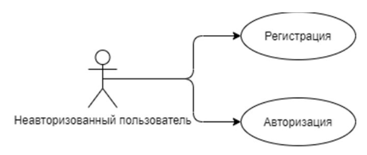
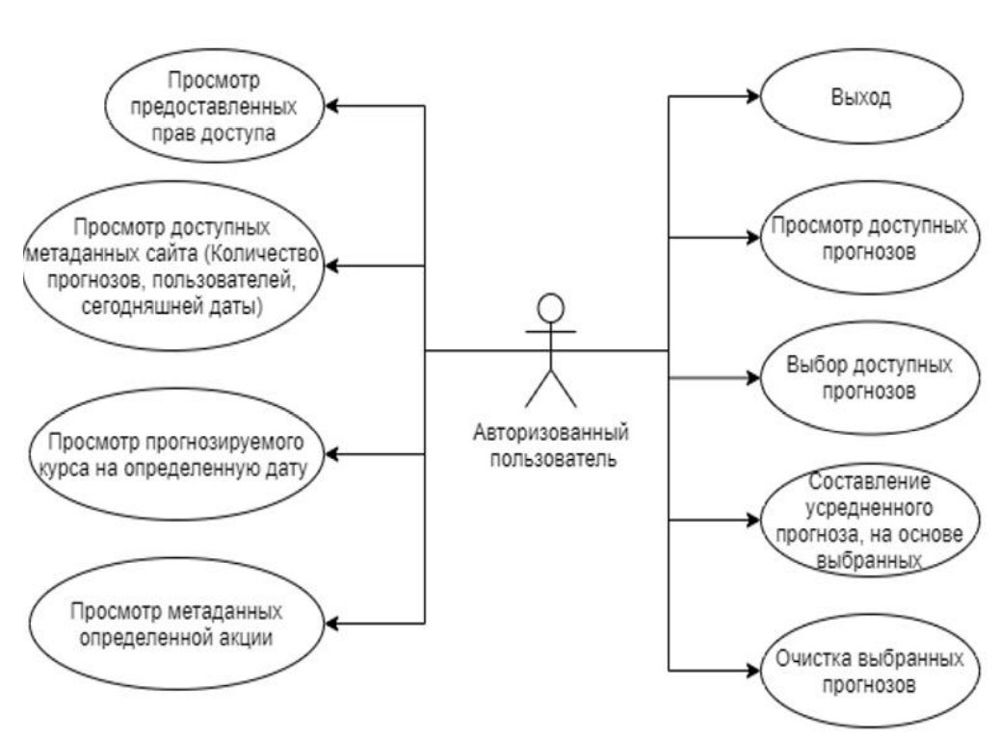
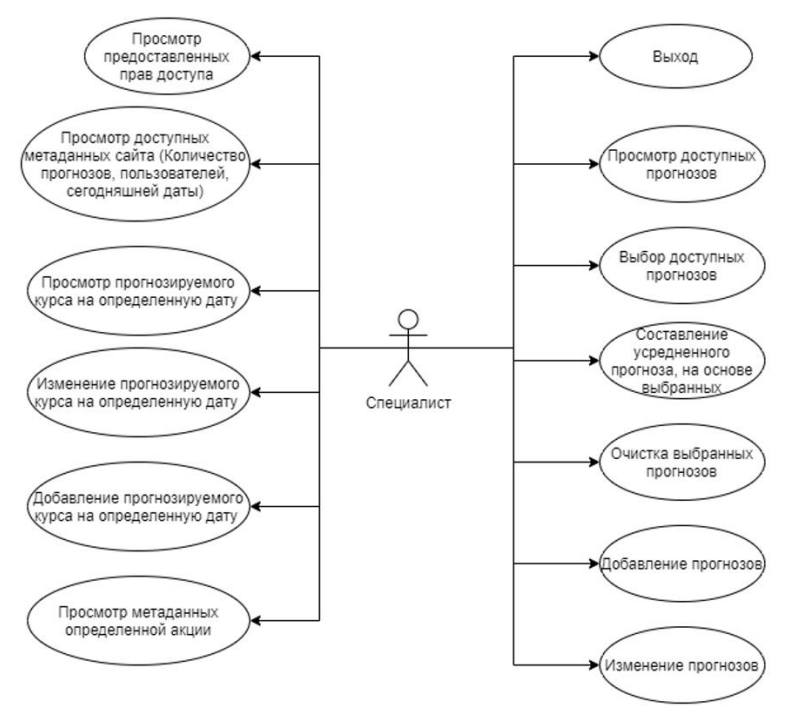
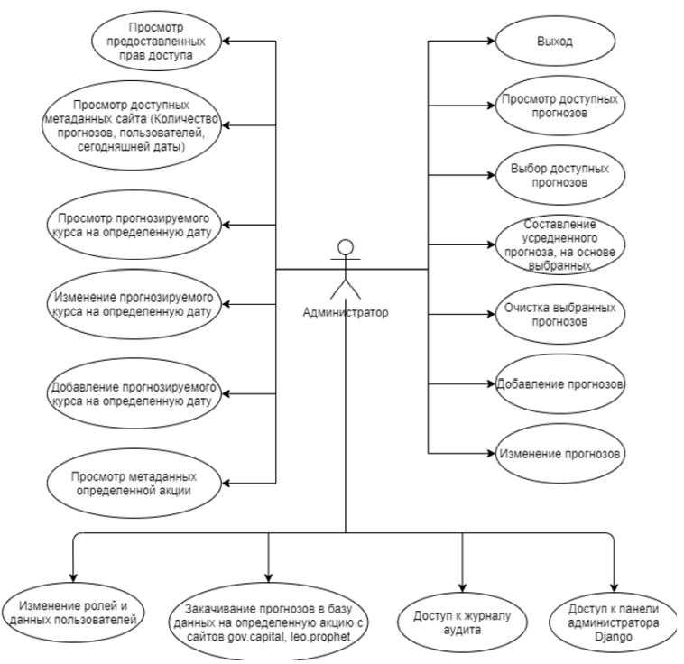
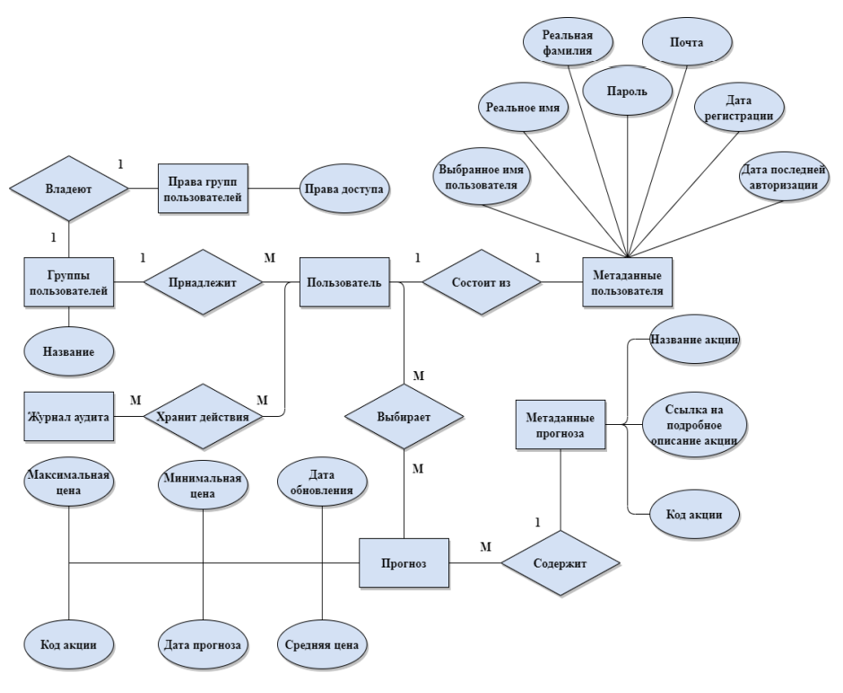

# StockF

## Цель работы

Разработать веб-приложение, позволяющее пользователю ознакомиться с 
прогнозами курса акций различных специалистов, хранящимися в базе данных. Реализовать три вида 
ролей – пользователь, специалист и администратор.

## Функциональные требования

- Регистрация пользователей в системе
- Авторизация пользователей в системе
- Добавление и удаление прогнозов для специалиста и администратора
- Выбор прогнозов по коду акции и аналитику
- Отображение информации в табличном представление и графике

## Use-case диаграммы системы

__Неавторизованный пользователь__

__Авторизованный пользователь__

__Специалист__

__Администратор__

## ER-диаграмма сущностей

